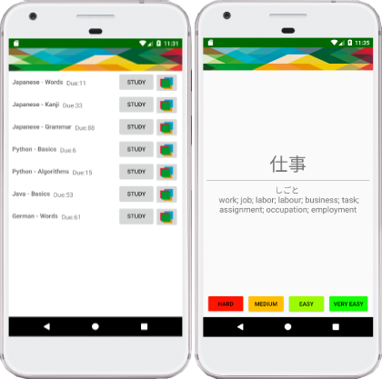

## Android
This is an android application made for studying flash cards.
Each flash card contains a question and an answer.
Each time a card is studied, the next review date will be based on
the previous study history for the card and a suitable date will be picked 
for optimal learning.

 

## General info
This project used to be a desktop application. There are still some functionality to 
be implemented from the old codebase.

## Node
Needed to run the whole system:
* Webservice - https://github.com/jonaselmesten/learndeck-webservice
* MySQL or similar DBMS for holding card data etc (interacts with webservice).
* Amazon AWS account for image resources (interacts with webservice).

